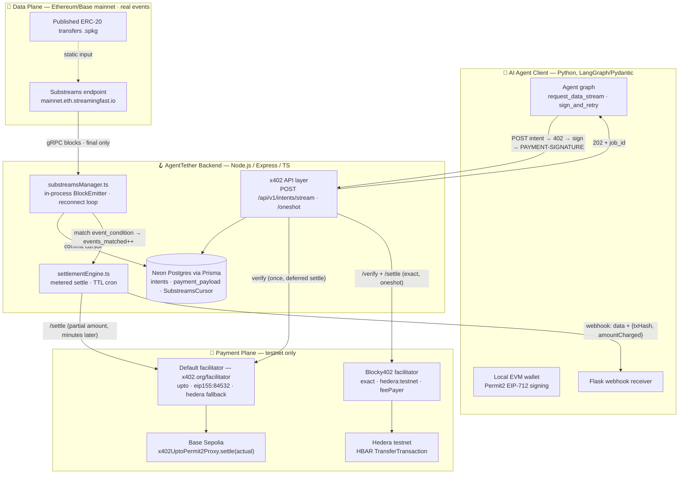
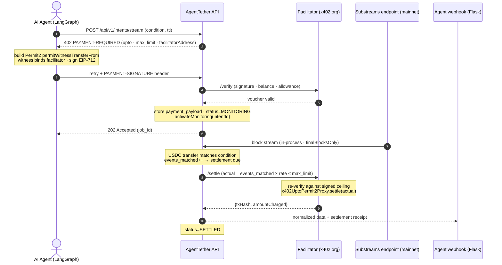
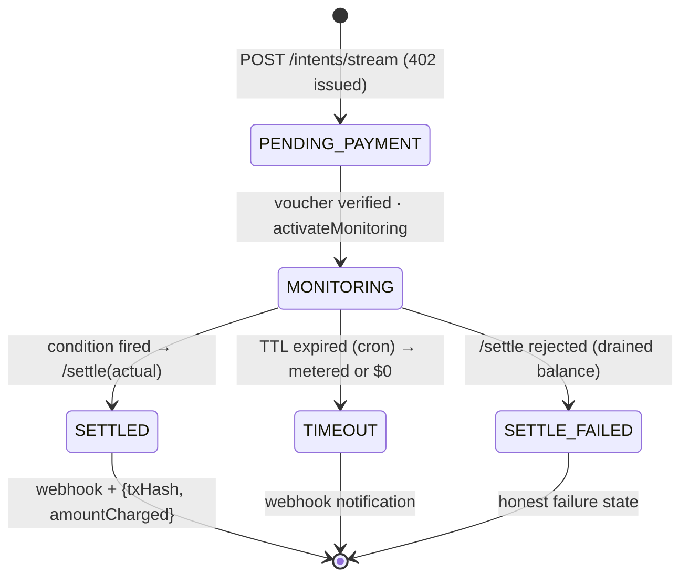

# 🪝 AgentTether
**ETHOnline 2026 Hackathon** | **Category:** Artificial Intelligence | **Tracks:** The Graph (Best AI Tooling), Hedera (AI & Agentic Payments)

## 📖 Overview
AgentTether lets autonomous AI agents provision and pay for conditional, asynchronous webhooks for future blockchain events — metered, escrow-free, and settled only for what actually fires. It is application-layer middleware bridging the **x402 HTTP payment standard** with **The Graph's Substreams**: instead of locking capital in smart contracts, agents sign metered, partial-fill cryptographic vouchers (Permit2 via the x402 `upto` scheme) that the Express backend holds until the condition is met or a Time-to-Live (TTL) expires — then settles only for the resources actually consumed.

> **What the agent pays for:** conditional data delivery — blockchain events matching its declared condition, pushed to its webhook the moment they fire, metered per delivered event (`events_matched × rate_per_event_atomic`) and capped by the ceiling it signed. Idle monitoring is free: an intent that never matches settles **$0** (no on-chain transaction — the authorization simply expires). There is no capital lockup: the voucher *authorizes*, it does not escrow, so funds stay in the agent's wallet until the deferred settlement actually executes. And the agent buys results, not infrastructure — AgentTether absorbs the Substreams endpoint, cursor management, and reorg handling. The one trust assumption (inherited from `upto` itself): the metered count is server-computed, with the signed ceiling bounding the worst case. The one-shot endpoint is the contrasting product: flat fee, immediate response, no TTL, no metering.

> **Demo architecture note (deliberate cross-chain split):** the **data plane** observes **Ethereum/Base mainnet** (organic USDC transfer velocity — real events, no scripted triggers), while the **payment plane** executes all x402 financial settlement safely on **Base Sepolia** testnet (plus Hedera testnet for the one-shot endpoint). The two planes are independent by design; this split should be acknowledged explicitly in the agent's system prompt and will be narrated in any demo video.
>
> **Why Base Sepolia for settlement?** It is the only chain the hosted default facilitator advertises for x402 v2 on EVM (`/supported`: `upto` and `exact` on `eip155:84532` only — Ethereum Sepolia and other L2s are absent), it has canonical Circle USDC, and it is the x402 ecosystem's first-class chain. The constraint is the settlement service's, not ours — which is exactly why the data plane is kept chain-agnostic: Substreams can observe any mainnet regardless of where settlement runs.

## 🛠 Tech Stack
* **Backend API:** Node.js, Express, TypeScript.
* **x402 Integration:** `@x402/express` middleware for server-side payment interception (`upto` scheme on Base Sepolia via the default facilitator; `exact` scheme on Hedera testnet via the bounty-mandated **Blocky402** facilitator).
* **Database / ORM:** PrismaClient with a Serverless Neon Postgres database.
* **Web3/Crypto:** `ethers.js` or `viem` for Permit2 (EIP-712) signature verification and facilitator-mediated settlement.
* **Data Layer:** Substreams Direct Streaming — `@substreams/node` JS SDK embedded in the Express process (the docs' "Direct Streaming" consumption pattern; no separate sink process, no webhook hop).
* **Agent Framework:** LangGraph or Pydantic AI.

> **Data-plane COGS (the middleware's cost side):** Substreams endpoints are usage-billed — e.g., Pinax charges **$1.75 per million processed blocks** (+ $150/TiB egress), with a free plan including $25/mo of usage; StreamingFast runs the same model. Ethereum mainnet is ~7,200 blocks/day, so a stream running 24/7 bills ≈ **$0.013/day** — a demo window costs fractions of a cent, and the free tier's included usage covers ~5 years of continuous streaming. Because cost scales with **stream uptime, not with intents or events**, one shared long-lived stream serving all intents (2.2) is the right shape, and marginal cost per delivered event is ≈ $0 — a handful of delivered events per day covers the stream entirely. The production cost lever we don't control: billed blocks include *every* block the module processes, and the published `.spkg`s ship no block-index filter tuned to our needs (see risk #5) — noise at hackathon scale, but as a product a custom module with a USDC-log index filter would cut billed blocks ~100×.

---

## 🗺️ System Architecture

> Three views: the components and the deliberate two-plane split, the end-to-end metered flow (demo beat A), and the intent lifecycle (the `status` enum from Phase 1). Note the **absence of any edge between the data plane and the payment plane** — they are independent by design.

### Components — data plane vs payment plane



### End-to-end metered flow (demo beat A)



### Intent lifecycle (metered stream endpoint)

Scoped to `/api/v1/intents/stream` only — the `/oneshot` Hedera flow is flat-fee, creates no intent, and has no lifecycle states.



---

## 🏗 Implementation Checklist 

### Phase 1: Database & Escrow State Management
> **Goal:** Set up the tracking layer for intents, TTLs, and voucher limits.
- [x] **1.1** Initialize the Node.js project and install dependencies (`npm install express @x402/core @x402/express @x402/evm prisma @prisma/client node-cron @substreams/node @substreams/core @substreams/manifest` + dev deps `tsx typescript`). No `tweetnacl` — there is no inbound sink webhook to authenticate anymore (data arrives in-process, authenticated outbound via `SUBSTREAMS_API_KEY`). Note: `@substreams/*` packages are ESM-only — the project runs as ESM (`"type": "module"`) via `tsx`. **Done:** `@x402/*` pinned at 2.25.0 (the spike-validated versions); `prisma`/`@prisma/client` pinned at 6.x (v7 moved connection URLs out of `schema.prisma` into `prisma.config.ts` + driver adapters — not worth the friction for a hackathon).
- [x] **1.2** Connect to the Neon Postgres database in `.env` (`DATABASE_URL`). **Done** — Neon Postgres connected.
- [x] **1.3** Define the `schema.prisma` file with an `Intent` model (renamed from `ChronosIntent` — stale branding). Include fields:
  - `id` (String, UUID)
  - `agent_wallet` (String)
  - `target_contract` (String)
  - `ttl_timestamp` (DateTime)
  - `max_limit_atomic` (String — USDC atomic units, never Float)
  - `rate_per_event_atomic` (String — USDC atomic units; the metered unit is a *matching event*, not a block)
  - `events_matched` (Int, default 0)
  - `payment_nonce` (String, unique — correlates the payment payload to the intent; **nullable**, since the nonce only arrives with the payment retry per 3.3)
  - `payment_payload` (Json — the verified Permit2 authorization, stored for deferred settlement)
  - `event_condition` (Json — e.g. `{"minAmount": "100000000000"}`)
  - `status` (Enum: `PENDING_PAYMENT`, `MONITORING`, `SETTLED`, `TIMEOUT`, `SETTLE_FAILED`)
  - `webhook_url` (String, optional)
- [x] **1.4** Run `npx prisma db push` to sync the schema. **Done** — schema synced to Neon in 1.5s; CRUD smoke test (`npm run smoke`) passes the full lifecycle: create `PENDING_PAYMENT` → verified payment → `MONITORING` → `events_matched` increment → expired query → `SETTLED` → cleanup. `/healthz` boots green.
- [x] **1.5** Write a database utility module (`db.ts`) with CRUD functions for creating intents and updating statuses. **Done:** `src/db.ts` — Prisma singleton + `createIntent`, `getIntent(ByPaymentNonce)`, `storeVerifiedPayment` (sets `MONITORING`), `updateIntentStatus`, `incrementEventsMatched`, monitoring/expired queries, and cursor `get/save` (upsert singleton).
- [x] **1.6** Create `.env.example` with: `DATABASE_URL`, `FACILITATOR_URL` (default `https://x402.org/facilitator`), `HEDERA_FACILITATOR_URL` (Blocky402 hosted testnet: `https://api.testnet.blocky402.com`), `NETWORK=eip155:84532` (payment plane), `DATA_CHAIN=ethereum-mainnet` (data plane — which chain the Substreams stream observes, independent of `NETWORK`), `USDC_ADDRESS=0x036CbD53842c5426634e7929541eC2318f3dCF7e`, `PAY_TO_ADDRESS`, `HEDERA_PAY_TO` (receiving Hedera account id, e.g. `0.0.xxxx`), `SUBSTREAMS_ENDPOINT` (Substreams data-plane endpoint, e.g. `https://mainnet.eth.streamingfast.io` or `https://eth.substreams.pinax.network`), `SUBSTREAMS_API_KEY`. **Done** (plus `PORT`).
- [x] **1.7** Add a `SubstreamsCursor` persistence model (single-row state: `cursor` String, `block_num` Int, `updated_at` DateTime). The JS SDK docs mandate persisting the committed cursor so reconnects resume from the last consumed block — this replaces the sink binaries' local `cursor.lock`/`state.cursor` files, which die with the container. **Done:** model in `prisma/schema.prisma`, `getCursor`/`saveCursor` in `src/db.ts`.

### Phase 2: Substreams Direct Streaming (in-process)
> **Goal:** Stream on-chain events directly into the Express process via the Substreams JS SDK — the docs' sanctioned "Direct Streaming" pattern for an application that consumes Substreams itself. No separate sink process, no webhook endpoint, no public tunnel; events are matched to active intents in-process.
- [ ] **2.1** Create a `substreamsManager.ts` module.
- [ ] **2.2** Implement `activateMonitoring(intentId)` as a DB-level helper that activates intent matching — **not** a process spawner. One long-lived in-process stream serves all intents.
- [ ] **2.3** Implement the streaming loop per the official Direct Streaming pattern (`docs.substreams.dev/how-to-guides/sinks/stream/javascript.md`): read the published `.spkg` via `@substreams/manifest` (`readPackage` → `createRegistry`/`createRequest`), connect a `BlockEmitter` (`@substreams/node`) to `SUBSTREAMS_ENDPOINT` with `SUBSTREAMS_API_KEY`, and wrap it in the docs' reconnect loop — long-lived gRPC connections **will** disconnect, which is normal: catch retryable errors, back off, and resume from the persisted cursor (`SubstreamsCursor` from 1.7). On each `anyMessage`, decode the ERC-20 transfer and match it against active `MONITORING` intents (2.4), then commit the returned cursor to Postgres. Use `finalBlocksOnly` to sidestep undo/reorg handling entirely (demo-adequate; see risk #6).
- [ ] **2.4** Implement a standardization function that takes each decoded Substream event, filters it against each intent's `event_condition` (e.g. minimum transfer amount), and formats matches into a unified JSON structure for the end-user agent. Filtering happens in Express, not in the substream manifest.
- [ ] **2.5** Demo: Stream **mainnet** in-process (`DATA_CHAIN=ethereum-mainnet`, or Base mainnet) against `SUBSTREAMS_ENDPOINT` (e.g. `https://mainnet.eth.streamingfast.io` or `https://eth.substreams.pinax.network`) with a published ERC-20 transfers `.spkg` (no custom Rust build — verified releases: `streamingfast/substreams-eth-token-transfers` v0.4.0, `pinax-network/substreams-erc20-transfers` v0.1.4; also on the `spkg.io` registry), near-head start block, and `finalBlocksOnly`. Mainnet is used deliberately for organic event velocity — no scripted triggers needed for the demo. `SUBSTREAMS_API_KEY` from StreamingFast or a Pinax account. No Docker container, no `WEBHOOK_URL`, no public tunnel: the stream lives inside the Express process, so the webhook hop and its signature verification disappear entirely. The stream's chain is fully independent of the payment plane (`NETWORK=eip155:84532`, Base Sepolia).
- [ ] **2.6** Demo: On each matching event, increment `events_matched` for active `MONITORING` intents and trigger the settlement flow.

### Phase 3: x402 Middleware API (Express)
> **Goal:** Build the HTTP negotiation layer that issues x402 payment requirements using Express middleware.
- [ ] **3.1** Initialize the Express app and configure the `@x402/express` middleware package (v2 semantics: `PAYMENT-REQUIRED` / `PAYMENT-SIGNATURE` / `PAYMENT-RESPONSE` headers). Note the flow split: standard `paymentMiddleware` **auto-settles after the handler responds** (actual amount via `setSettlementOverrides`) — that synchronous behavior is only right for `/oneshot`. The `/stream` route must bypass auto-settlement entirely (manual facilitator `/verify` here, deferred `/settle` in Phase 4), because its settlement happens minutes/hours after the `202`.
- [ ] **3.2** Implement the `POST /api/v1/intents/stream` route (single route, idiomatic x402 flow).
  - Accept `query_intent`, `target_contract`, `event_condition`, and `ttl_seconds` in the JSON body.
  - Calculate `max_limit_atomic` heuristically from TTL and rate (accounting for chain block time, e.g. Base ≈ 2s/block).
  - Save the intent to the Prisma database with status `PENDING_PAYMENT`.
  - Return HTTP status `402 Payment Required` with `PaymentRequired` specifying `scheme: "upto"`, `network: "eip155:84532"`, `amount: max_limit_atomic`, `asset: USDC`, `payTo`, and `extra.facilitatorAddress` (discovered from the facilitator's `/supported` endpoint).
- [ ] **3.3** On the client's retry with the `PAYMENT-SIGNATURE` header (containing the Permit2 `permitWitnessTransferFrom` authorization):
  - Verify the payload via the facilitator's `/verify` endpoint (checks signature, balance, and Permit2 allowance).
  - Correlate the payment to the intent via the **permit nonce** (`payment_nonce` as idempotency key).
  - Require `permit2Authorization.deadline` ≥ `ttl_timestamp + cron buffer` so the voucher is still valid when settlement occurs.
  - Store the full verified payload in `payment_payload`, update status to `MONITORING`, and activate intent matching via `activateMonitoring` from Phase 2.
  - Do **not** mount this route under `paymentMiddleware`'s auto-settlement path: call the facilitator client's `/verify` directly and return `202` with no settlement — the actual `/settle` fires later from the settlement engine (Phase 4). The verify→settle gap is spiked on day 1 (see 4.2, risk #1).
  - Return HTTP status `202 Accepted` and a monitoring `job_id`.
- [ ] **3.4** Implement `POST /api/v1/intents/oneshot` — a flat-fee, non-metered endpoint for the Hedera track, with **per-network facilitator routing**.
  - Advertise `accepts` with both `exact` on Base Sepolia (USDC, `payTo: PAY_TO_ADDRESS`) and `exact` on `hedera:testnet` (HBAR via `asset: "0.0.0"`, or an HTS token id; `payTo: HEDERA_PAY_TO`).
  - **Dynamic facilitator override (bounty-driven, not technical):** maintain a network→facilitator routing map. `eip155:*` payloads go to the default `FACILITATOR_URL`; any payload whose `accepted.network` matches `hedera:*` has its `/verify` and `/settle` calls dynamically rerouted to `HEDERA_FACILITATOR_URL` (Blocky402, as named by the Hedera bounty). Important correction: the default x402.org facilitator **does** natively support `exact` on `hedera:testnet` (verified via `/supported`: `signers["hedera:*"] = ["0.0.9185802"]`) — the routing exists because the bounty mandates Blocky402, not because Hedera is otherwise unsettleable. This makes the default facilitator the degraded-mode Hedera fallback (risk #4). Implement either as two middleware instances mounted per network, or a routing wrapper around the facilitator client that selects the base URL from `payload.accepted.network`.
  - The Hedera `PaymentRequirements` must include `extra.feePayer`, discovered from Blocky402's `GET /supported` (`signers["hedera:*"][0]`) — Blocky402 co-signs the `TransferTransaction` as fee-payer at settlement time, and verification rejects a mismatched fee-payer.
  - Demo pays on Hedera and shows the HashScan receipt.

### Phase 4: Escrow & Settlement Engine
> **Goal:** Manage the financial lifecycle of the vouchers (metered settlement or timeout).
- [ ] **4.1** Write a `settlementEngine.ts` module.
- [ ] **4.2** Create the `executeSuccessSettlement(intentId)` function.
  - Calculate final cost: `actual = events_matched * rate_per_event_atomic` (capped at `max_limit_atomic`).
  - Submit to the facilitator's `/settle` endpoint with `paymentRequirements.amount = actual` and the stored Permit2 payload. The facilitator re-verifies the signature against the signed ceiling and settles the actual (partial) amount on-chain via the `x402UptoPermit2Proxy` contract.
  - Update DB status to `SETTLED` (or `SETTLE_FAILED` on facilitator rejection, e.g. if the agent drained its balance).
  - Fire the normalized data payload plus `{txHash, amountCharged}` to the agent's provided `webhook_url`.
  - **Fail-closed delivery (the security invariant):** delivery is strictly post-settlement — the webhook fires only after the settlement receipt confirms on-chain (a few confirmations on Base Sepolia). Never batch or reorder deliver-before-settle: no confirmed settlement → no data. This is what makes deferred settlement safe against "consume events without paying" (risk #8).
  - **Day-1 spike:** against the default facilitator, `/verify` an `upto` payload, wait 5+ minutes, then `/settle` with `paymentRequirements.amount < permitted.amount`. The spec's settle-time verification rules (facilitator re-verifies the signature against `permitted.amount`, confirms `actual <= permitted`, transfers `actual`) say this must pass — but standard `upto` examples always settle synchronously inside the request, so no published example exercises a long verify→settle gap. Prove it before anything else is built on top (risk #1). Fallback if the hosted facilitator balks: self-host the facilitator (open-source, Apache-2.0) where settle-time re-verification is under our control. **Validated Day 1 — see Spike Results (hosted facilitator accepted the 5-minute gap).**
- [ ] **4.3** Implement `node-cron` to query the Prisma database every minute for `status == MONITORING` where `ttl_timestamp < NOW()`.
- [ ] **4.4** Create the `executeTimeoutSettlement(intentId)` function.
  - Triggered by the cron job.
  - Settle only the **metered usage consumed** (`events_matched * rate_per_event_atomic`), or **$0** if nothing was processed (spec-supported: no on-chain transaction, the authorization simply expires). Never settle the full `max_limit` on timeout.
  - Update DB status to `TIMEOUT`.
  - Fire a timeout notification to the agent's webhook — **without event data** unless the metered settle succeeded; data delivery always requires a confirmed settlement (fail-closed invariant, see 4.2).

### Phase 5: Multi-Agent Client Implementation
> **Goal:** Build the LangGraph / Pydantic (TBD) AI client that interacts with the backend.
- [ ] **5.1** Create a new Python project for the AI agent client.
- [ ] **5.2** **Day-1 spike (narrowed):** the Python `x402` SDK **natively supports `upto`** — `from x402.mechanisms.evm.upto import UptoEvmScheme; client.register("eip155:*", UptoEvmScheme(signer))` (confirmed in the official x402 v2 docs). The spike narrows to confirming Python-side Permit2 approval bootstrap / `eip2612GasSponsoring` extension parity — the TS SDK does this via optional RPC config, so verify the Python client behaves the same end-to-end against the default facilitator. Hand-rolled `eth_account` EIP-712 signing (~50 lines) + EIP-2612 permit remains the fallback; worst case, write the agent in TypeScript.
- [ ] **5.2a** **Permit2 approval bootstrap (capability-detect, don't assume):** before the first x402 flow, the agent must ensure USDC is approved for the canonical Permit2 contract. Implement a three-way branch:
  1. **Cheap pre-check:** read `USDC.allowance(agent, Permit2)` on-chain (gasless eth_call). If it already covers `max_limit`, skip approval entirely — do this check on every run so repeat demos are one-signature flows.
  2. **Gasless path (preferred):** if the facilitator's `GET /supported` `extensions` list includes `eip2612GasSponsoring` (the default `https://x402.org/facilitator` advertises both `eip2612GasSponsoring` and `erc20ApprovalGasSponsoring` — verified live via `/supported`; still probe at startup rather than hardcode), sign an EIP-2612 `permit` approving Permit2 and attach it per the extension spec; the facilitator batches `settleWithPermit` so no agent ETH is needed. Note the x402 `upto` spec prefers `settleWithPermit` over the naive "broadcast approval tx then settle" reading — the batching happens inside the proxy call, not as two separate transactions.
  3. **Self-funded fallback:** if the extension is absent (e.g. a swapped-in backup facilitator), the agent needs a small amount of Base Sepolia ETH to broadcast the `approve(Permit2)` transaction itself before initiating the x402 flow. Detect this at startup and fail fast with a clear "fund 0xAgent… with Base Sepolia ETH" message rather than mid-demo. Keep a faucet link in the runbook and pre-fund the demo wallet regardless.
  - Cache the result: the approval is one-time per wallet, so record it (e.g. a local `state.json`) and only redo it if the allowance drops below `max_limit`.
- [ ] **5.3** Define a LangGraph node `request_data_stream`.
  - Send the initial POST to `/api/v1/intents/stream` using the `x402` Python SDK.
  - Catch the 402 response and parse the `PaymentRequired` parameters.
- [ ] **5.4** Define a LangGraph node `sign_and_retry`.
  - Programmatically structure the Permit2 authorization (`permitted.token`, `permitted.amount = max_limit`, `spender`, `nonce`, `deadline`, witness) based on the 402 requirements.
  - Sign the payload using a local wallet private key.
  - Attach the payload to the `PAYMENT-SIGNATURE` header and retry the POST request.
- [ ] **5.5** Set up a lightweight Flask server on the agent side to receive the final incoming webhook data from the AgentTether backend.
- [ ] **5.5a** **Transparency in the agent's prompts:** include an explicit disclosure in the agent's system prompt, e.g. *"You are observing Ethereum/Base mainnet for data velocity (real, organic on-chain events), but all x402 financial settlement executes safely on Base Sepolia testnet. The observed data and the payment rail are on different chains by design."* The agent should also state this split in its final summary output when reporting results, so the acknowledgment appears in logs and transcripts as a matter of course.
- [ ] **5.6** Write a test script running the full end-to-end flow to record for the hackathon demo, covering three outcomes:
  - **(A)** Event fires → partial settlement (show Base Sepolia explorer link).
  - **(B)** TTL expires → metered or $0 timeout settlement.
  - **(C)** Hedera one-shot payment via `/api/v1/intents/oneshot` (show HashScan link). The Python SDK has no Hedera scheme, so run this beat with a small Node script using `@x402/hedera` (`ExactHederaScheme` + `createClientHederaSigner`) + `@x402/fetch`, which builds the partially-signed `TransferTransaction` Blocky402 co-signs at settlement.
  - **Demo video requirement:** the narration must explicitly acknowledge the cross-chain split — mainnet data observation for velocity, Base Sepolia (and Hedera testnet) for settlement — ideally with the two explorer pages side by side (mainnet USDC transfer that triggered the webhook + Base Sepolia settlement tx).

---

## 🧪 Spike Results (Day 1)

Before building any server code, the top risk (deferred settlement) was validated empirically against the **hosted default facilitator** using a standalone TypeScript client (`spikes/deferred-settle.ts` — no backend, no DB; its payload-construction code becomes the Phase 5 agent client, its verify/settle-driving code the Phase 5.6 harness skeleton).

**Reproduce it** — needs a wallet with Base Sepolia USDC ([faucet.circle.com](https://faucet.circle.com)) plus a little Base Sepolia ETH (one-time `approve(Permit2)` tx):

```bash
cd spikes && npm install
export EVM_PRIVATE_KEY=0x...   # funded Base Sepolia wallet — keep it out of the repo
npm run spike -- exceed            # negative test: settle above ceiling → expect spec rejection
npm run spike -- zero              # settle 0 → success, NO on-chain tx (Phase 4.4 timeout path)
npm run spike -- full --wait 30    # fast debug loop with a 30s verify→settle gap
npm run spike -- full --wait 300   # THE GATE: 5-min verify→settle gap (risk #1)
```

Each run signs a fresh Permit2 nonce, so runs are order-safe. `npm run spike -- discover` (no key needed) shows the facilitator's live `/supported` kinds.

| Test | Expected | Result |
|---|---|---|
| `/verify` with ceiling (`5000000`) | valid | ✅ PASS |
| verify → **5-min gap** → `/settle` partial (`1858 ≤ 5000000`) | success + on-chain tx via `x402UptoPermit2Proxy` | ✅ PASS |
| `/settle` with `amount > permitted` | rejected per spec (`invalid_upto_evm_payload_settlement_exceeds_amount`) | ✅ PASS (rejected, nonce intact) |
| `/settle` with `amount = 0` | success, **no** on-chain transaction | ✅ PASS (validates the Phase 4.4 timeout path) |

The gap was exercised at 30s and 300s; both runs transferred exactly `1858` atomic units to a fresh, unfunded receiver.

**Findings captured along the way:**
- **One-time Permit2 approval race:** the very first `/verify` after broadcasting `USDC.approve(PERMIT2, max)` returned the spec's designated precondition error (`permit2_allowance_required`) — the facilitator's RPC still read the stale allowance; a retry passed. Self-healing and one-time per wallet: exactly the behavior Phase 5.2a's allowance pre-check exists to hide. Post-settlement allowance is `maxUint256 − 1858` (Permit2's `transferFrom` decrements it per settle), independently corroborating the on-chain settlement.
- **Deadline derivation:** the SDK derives the Permit2 `deadline` from `maxTimeoutSeconds` (sign-time + 3600s), confirming the Phase 3.3 design that `maxTimeoutSeconds ≥ TTL` provides the deferred-settle deadline margin.
- **Payload shape matches the spec annex:** the signed payload's `spender` is the `x402UptoPermit2Proxy`, and the settlement tx emits an event **from the proxy contract itself**.

---

## ⚠️ Risk Register (ordered)

1. **Deferred settlement (verify→settle time gap)** — ✅ **RESOLVED (Day 1 spike — see Spike Results):** the hosted default facilitator accepted a stored voucher settled after a 5-minute verify→settle gap, transferring exactly the partial amount on-chain via `x402UptoPermit2Proxy` ([tx](https://sepolia.basescan.org/tx/0x69c7f98a7f55b02fcfaf85a5ac446cb0df5ea8438209424eaf629b085b0eac71)). Negative tests passed per spec: settle-above-ceiling rejected; $0 settle succeeds with no on-chain transaction. Residual risk is operational only; self-hosting the facilitator (Apache-2.0) remains the degraded-mode fallback.
2. **Python `upto` signing** — largely de-risked: the Python SDK natively supports `upto` (`x402.mechanisms.evm.upto.UptoEvmScheme`, per the official docs). Day-1 spike (Phase 5.2) narrows to Permit2-approval/`eip2612GasSponsoring` extension parity. Fallback: hand-rolled `eth_account` EIP-712 signing or a TypeScript agent.
3. **Permit2 approval UX** — handled by the capability-detect bootstrap in Phase 5.2a: allowance pre-check first, then the facilitator's `eip2612GasSponsoring` extension (default facilitator advertises it — confirmed live via `GET /supported`, still probe at startup), else a self-funded on-chain `approve` requiring Base Sepolia ETH. Pre-fund the demo wallet and keep a faucet link in the runbook so the fallback never blocks a live demo. **Observed Day 1:** the facilitator returns the spec's `permit2_allowance_required` when the allowance read races a fresh approval — self-heals on retry, one-time per wallet.
4. **Facilitator reliability** — both endpoints verified live: default `https://x402.org/facilitator` supports `upto` on `eip155:84532` **and** `exact` on `hedera:testnet` (`extra.feePayer` discoverable via `/supported`); Blocky402 `https://api.testnet.blocky402.com/supported` returns `hedera:testnet` with `feePayer 0.0.7162784`. EVM backup: CDP facilitator. Hedera backup: the default facilitator itself (it already integrates Hedera — the Blocky402 routing exists because the bounty mandates it, not because Hedera is otherwise unsettleable). The self-host fallback URL `github.com/blockydevs/blocky402` returns 404 — treat self-hosting Blocky402 as unverified.
5. **Published `.spkg` availability** — verified: `streamingfast/substreams-eth-token-transfers` v0.4.0 (ERC20/721/1155) and `pinax-network/substreams-erc20-transfers` v0.1.4 ship downloadable `.spkg` releases. Filtering events in Express (not in the manifest) keeps us decoupled from their params.
6. **`@substreams/node` SDK maturity & stream-loop correctness** — the JS SDK is younger and thinner-documented than the Go/CLI ecosystem (ESM-only, modest download volume). Mitigations: `finalBlocksOnly` sidesteps undo/reorg handling; the cursor-persist + reconnect loop is copied from the official docs' JS example; stream errors are contained behind a supervised restart. Rollback path: swap back to the built-in `substreams sink webhook` CLI (unsigned POST + shared-secret path) or the Pinax image (archived but functional, ed25519-signed) behind the same intent-matching interface in an afternoon.
7. **Demo timing** — use mainnet USDC for the data plane (frequent transfers) and Base Sepolia for payments; pick an `event_condition` threshold that will actually fire within the demo window. The cross-chain split is deliberate and disclosed (agent system prompt per 5.5a, video narration per 5.6), and reflects the chain-agnostic design of the data plane.
8. **Escrow-without-lock** — a held-but-unsettled voucher does not reserve funds; the agent could drain its wallet before settlement. Mitigated by facilitator `/verify` balance checks, prompt settlement, tight deadlines, and the honest `SETTLE_FAILED` state. **Fail-closed delivery is the guarantee that makes this safe:** the webhook carries event data only after a confirmed settlement receipt — a drained wallet yields `SETTLE_FAILED`, never delivered data. Residual abuse is nuisance-level only (intents that never settle = free monitoring load on us; mitigated by verify-time balance checks and per-wallet intent rate limits). Also validate `webhook_url` server-side (https-only, no private IP ranges) to close the SSRF surface.
