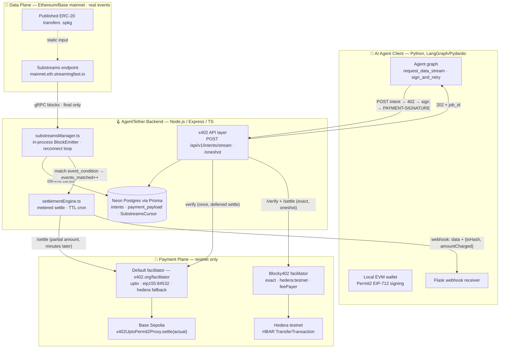
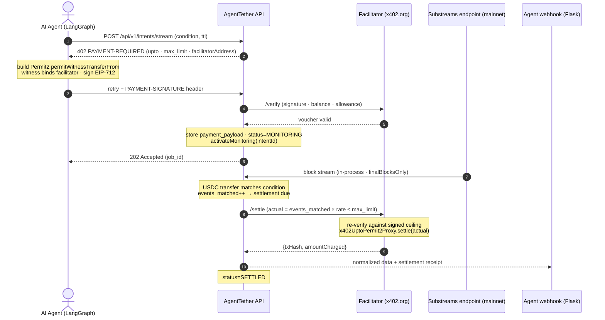
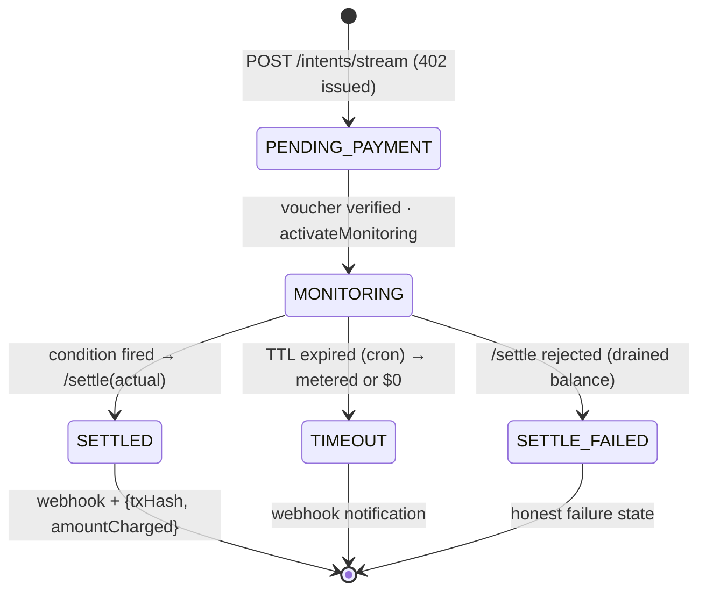

# 🪝 AgentTether
**ETHOnline 2026 Hackathon** | **Category:** Artificial Intelligence | **Tracks:** The Graph (Best AI Tooling), Hedera (AI & Agentic Payments)

[](https://github.com/roderickhodgson/AgentTether/actions/workflows/ci.yml)

## 📖 Overview
AgentTether lets autonomous AI agents provision and pay for conditional, asynchronous webhooks for future blockchain events — priced per block, escrow-free, and settled pro-rata. It is application-layer middleware bridging the **x402 HTTP payment standard** with **The Graph's Substreams**: instead of locking capital in smart contracts, agents sign a single Permit2 `upto` voucher whose ceiling is the quoted cost of their monitoring window; the backend holds it until the condition fires or the window expires — then settles exactly the blocks it processed.

> **What the agent pays for:** blocks processed on their behalf. The client sets a TTL; the backend quotes `⌈ttl ÷ blockTime⌉ blocks × per-block rate` as the voucher ceiling. The window ends at **whichever runs out first — the block budget or the TTL** — and the settlement is `blocks actually processed × rate`: fire at block 263 of a 10,000-block budget → settle 263 blocks (pro-rata); never fire → settle the full budget at TTL (the watch was subsidised); chain halts → the TTL backstop ends it and the client pays only for blocks that existed. Delivery is included: the matching events fire to the agent's webhook once, after the settlement receipt confirms (fail-closed). To keep listening, the client re-issues another voucher. There is no capital lockup: the voucher *authorizes*, it does not escrow — funds stay in the agent's wallet until the settlement executes, and an unclaimed remainder expires worthless. The one trust assumption (inherited from `upto` itself): the block count is server-computed, with the signed ceiling bounding the worst case. The one-shot endpoint is the contrasting product: flat fee, immediate response, no TTL, no metering.

> **Demo architecture note (deliberate cross-chain split):** the **data plane** observes **Ethereum/Base mainnet** (organic USDC transfer velocity — real events, no scripted triggers), while the **payment plane** executes all x402 financial settlement safely on **Base Sepolia** testnet (plus Hedera testnet for the one-shot endpoint). The two planes are independent by design; this split should be acknowledged explicitly in the agent's system prompt and will be narrated in any demo video.
>
> **Why Base Sepolia for settlement?** It is the only chain the hosted default facilitator advertises for x402 v2 on EVM (`/supported`: `upto` and `exact` on `eip155:84532` only — Ethereum Sepolia and other L2s are absent), it has canonical Circle USDC, and it is the x402 ecosystem's first-class chain. The constraint is the settlement service's, not ours — which is exactly why the data plane is kept chain-agnostic: Substreams can observe any mainnet regardless of where settlement runs.

## 🛠 Tech Stack
* **Backend API:** Node.js, Express, TypeScript.
* **x402 Integration:** `@x402/express` middleware for server-side payment interception (`upto` scheme on Base Sepolia via the default facilitator; `exact` scheme on Hedera testnet via the bounty-mandated **Blocky402** facilitator).
* **Database / ORM:** PrismaClient with a Serverless Neon Postgres database.
* **Web3/Crypto:** `ethers.js` or `viem` for Permit2 (EIP-712) signature verification and facilitator-mediated settlement.
* **Data Layer:** Substreams Direct Streaming — `@substreams/node` JS SDK embedded in the Express process (the docs' "Direct Streaming" consumption pattern; no separate sink process, no webhook hop).
* **Agent Framework:** LangGraph or Pydantic AI.
* **Logging:** pino (`LOG_LEVEL` gates verbosity: debug = per-match detail, info = lifecycle + sampled heartbeat; `LOG_PRETTY=1` for terminal output).

> **Data-plane COGS (the middleware's cost side):** Substreams endpoints are usage-billed — e.g., Pinax charges **$1.75 per million processed blocks** (+ $150/TiB egress), with a free plan including $25/mo of usage; StreamingFast runs the same model. Ethereum mainnet is ~7,200 blocks/day, so a stream running 24/7 bills ≈ **$0.013/day** — a demo window costs fractions of a cent, and the free tier's included usage covers ~5 years of continuous streaming. Because cost scales with **stream uptime, not with intents or events**, one shared long-lived stream serving all intents (2.2) is the right shape, and marginal cost per delivered event is ≈ $0 — a handful of delivered events per day covers the stream entirely. The production cost lever we don't control: billed blocks include *every* block the module processes, and the published `.spkg`s ship no block-index filter tuned to our needs (see risk #5) — noise at hackathon scale, but as a product a custom module with a USDC-log index filter would cut billed blocks ~100×.

---

## 🗺️ System Architecture

> Three views: the components and the deliberate two-plane split, the end-to-end metered flow (demo beat A), and the intent lifecycle (the `status` enum from Phase 1). Note the **absence of any edge between the data plane and the payment plane** — they are independent by design.

### Components — data plane vs payment plane



### End-to-end metered flow (demo beat A)



### Intent lifecycle (metered stream endpoint)

Scoped to `/api/v1/intents/stream` only — the `/oneshot` Hedera flow is flat-fee, creates no intent, and has no lifecycle states.



---

## 🏗 Implementation Checklist 

### Phase 1: Database & Escrow State Management
> **Goal:** Set up the tracking layer for intents, TTLs, and voucher limits.
- [x] **1.1** Initialize the Node.js project and install dependencies (`npm install express @x402/core @x402/express @x402/evm prisma @prisma/client node-cron @substreams/node @substreams/core @substreams/manifest` + dev deps `tsx typescript`). No `tweetnacl` — there is no inbound sink webhook to authenticate anymore (data arrives in-process, authenticated outbound via `SUBSTREAMS_API_KEY`). Note: `@substreams/*` packages are ESM-only — the project runs as ESM (`"type": "module"`) via `tsx`. **Done:** `@x402/*` pinned at 2.25.0 (the spike-validated versions); `prisma`/`@prisma/client` pinned at 6.x (v7 moved connection URLs out of `schema.prisma` into `prisma.config.ts` + driver adapters — not worth the friction for a hackathon).
- [x] **1.2** Connect to the Neon Postgres database in `.env` (`DATABASE_URL`). **Done** — Neon Postgres connected.
- [x] **1.3** Define the `schema.prisma` file with an `Intent` model (renamed from `ChronosIntent` — stale branding). Include fields:
  - `id` (String, UUID)
  - `agent_wallet` (String)
  - `target_contract` (String)
  - `ttl_timestamp` (DateTime)
  - `max_limit_atomic` (String — USDC atomic units, never Float)
  - `rate_per_event_atomic` (String — USDC atomic units; the metered unit is a *matching event*, not a block)
  - `events_matched` (Int, default 0)
  - `payment_nonce` (String, unique — correlates the payment payload to the intent; **nullable**, since the nonce only arrives with the payment retry per 3.3)
  - `payment_payload` (Json — the verified Permit2 authorization, stored for deferred settlement)
  - `event_condition` (Json — e.g. `{"minAmount": "100000000000"}`)
  - `status` (Enum: `PENDING_PAYMENT`, `MONITORING`, `SETTLED`, `TIMEOUT`, `SETTLE_FAILED`)
  - `webhook_url` (String, optional)
- [x] **1.4** Run `npx prisma db push` to sync the schema. **Done** — schema synced to Neon in 1.5s; CRUD smoke test (`npm run smoke`) passes the full lifecycle: create `PENDING_PAYMENT` → verified payment → `MONITORING` → `events_matched` increment → expired query → `SETTLED` → cleanup. `/healthz` boots green.
- [x] **1.5** Write a database utility module (`db.ts`) with CRUD functions for creating intents and updating statuses. **Done:** `src/db.ts` — Prisma singleton + `createIntent`, `getIntent(ByPaymentNonce)`, `storeVerifiedPayment` (sets `MONITORING`), `updateIntentStatus`, `incrementEventsMatched`, monitoring/expired queries, and cursor `get/save` (upsert singleton).
- [x] **1.6** Create `.env.example` with: `DATABASE_URL`, `FACILITATOR_URL` (default `https://x402.org/facilitator`), `HEDERA_FACILITATOR_URL` (Blocky402 hosted testnet: `https://api.testnet.blocky402.com`), `NETWORK=eip155:84532` (payment plane), `DATA_CHAIN=ethereum-mainnet` (data plane — which chain the Substreams stream observes, independent of `NETWORK`), `USDC_ADDRESS=0x036CbD53842c5426634e7929541eC2318f3dCF7e`, `PAY_TO_ADDRESS`, `HEDERA_PAY_TO` (receiving Hedera account id, e.g. `0.0.xxxx`), `SUBSTREAMS_ENDPOINT` (Substreams data-plane endpoint, e.g. `https://mainnet.eth.streamingfast.io` or `https://eth.substreams.pinax.network`), `SUBSTREAMS_API_KEY`. **Done** (plus `PORT`).
- [x] **1.7** Add a `SubstreamsCursor` persistence model (single-row state: `cursor` String, `block_num` Int, `updated_at` DateTime). The JS SDK docs mandate persisting the committed cursor so reconnects resume from the last consumed block — this replaces the sink binaries' local `cursor.lock`/`state.cursor` files, which die with the container. **Done:** model in `prisma/schema.prisma`, `getCursor`/`saveCursor` in `src/db.ts`.

### Phase 2: Substreams Direct Streaming (in-process)
> **Goal:** Stream on-chain events directly into the Express process via the Substreams JS SDK — the docs' sanctioned "Direct Streaming" pattern for an application that consumes Substreams itself. No separate sink process, no webhook endpoint, no public tunnel; events are matched to active intents in-process.
- [x] **2.1** Create a `substreamsManager.ts` module. **Done** — with connection, cursor, reconnect and matching.
- [x] **2.2** Implement `activateMonitoring(intentId)` as a DB-level helper that activates intent matching — **not** a process spawner. One long-lived in-process stream serves all intents. **Done** (in `src/db.ts`).
- [x] **2.3** Implement the streaming loop per the official Direct Streaming pattern (`docs.substreams.dev/how-to-guides/sinks/stream/javascript.md`): read the published `.spkg` via `@substreams/manifest` (`readPackage` → `createRegistry`/`createRequest`), connect a `BlockEmitter` (`@substreams/node`) to `SUBSTREAMS_ENDPOINT` with `SUBSTREAMS_API_KEY`, and wrap it in the docs' reconnect loop — long-lived gRPC connections **will** disconnect, which is normal: catch retryable errors, back off, and resume from the persisted cursor (`SubstreamsCursor` from 1.7). On each `anyMessage`, decode the ERC-20 transfer and match it against active `MONITORING` intents (2.4), then commit the returned cursor to Postgres. **Live-verified.** One amendment vs the original plan: **head-streaming is the default, not `finalBlocksOnly`** — a live test showed `finalBlocksOnly` delays first delivery by up to ~13 min (Ethereum finality), which kills demo timing. Undo handling is instead done by reverting the persisted cursor to the undo's `lastValidCursor` (counter rollback skipped — demo-adequate, see risk #6). `SUBSTREAMS_FINAL_BLOCKS_ONLY=true` opts back into finality mode when freshness doesn't matter. **Downtime semantics (measured):** on restart the stream replays every block since the persisted cursor and is billed at the standard rate (≈$0.04 per idle day, per the COGS note). The **server** replays history far faster than real-time, but our **client pipeline is the bottleneck**: ~280ms/block of serialized Neon round trips → ~3.6 blocks/s with an actively-matching intent, ~60–90 blocks/s without metering (measured 2026-09-05: a 9.4h gap ≈ ~13 min to catch up with an in-TTL intent matching; a true 24h idle ≈ ~30+ min). Reconciliation across the replay was exact (5,732 MATCH lines = 5,732 metered events — zero loss, zero duplication). Catch-up metering respects intent windows: the matcher skips events whose block timestamp falls outside `[createdAt, ttlTimestamp]`, so downtime can neither over-charge expired intents nor retroactively bill events that predate a fresh intent. Metering is batched per block (one UPDATE per intent — a 3-day catch-up is ~150k matches, not 150k sequential writes), and repeated resume failures wipe the stored cursor and restart from head (recovery for spkg upgrades, which invalidate cursors via module hash). Progress is visible via a sampled heartbeat log (`block N · X min behind wall clock`) at info level; per-match detail logs at debug (`LOG_LEVEL=debug`). For demo/practice resets, `npm run reset` deletes all intents + the cursor so the next stream starts fresh from head — the escape hatch when a long-idle catch-up isn't worth replaying. **Crash semantics (atomic per block):** metering and the cursor commit in one transaction — a crash mid-block rolls back both, so the restart replays the block cleanly and the at-least-once double-metering window is closed (a crash right before the cursor save no longer re-counts that block's matches). The settlement-engine trigger fires strictly *after* the transaction commits (external side effects can't live inside one) and must remain idempotent in Phase 4: status-machine check (`SETTLED` intents are excluded from matching) + the Permit2 nonce being single-use on-chain.
- [x] **2.4** Implement a standardization function that takes each decoded Substream event, filters it against each intent's `event_condition` (e.g. minimum transfer amount), and formats matches into a unified JSON structure for the end-user agent. Filtering happens in Express, not in the substream manifest. **Done** — contract match (hex-normalized) + `BigInt(value) ≥ minAmount`, gated to the intent's `[createdAt, ttlTimestamp]` window (start guard added after the catch-up test showed a fresh intent would retroactively match pre-creation history); normalized payload `{intentId, chain, block, blockTimestamp, txHash, logIndex, contract, from, to, amount}`; live matches ~4–10/block at the 1,000-USDC threshold. Both guards verified by backdate tests (future-bounded → 0 matches; past-open → matches).
- [ ] **2.5** Demo: Stream **mainnet** in-process (`DATA_CHAIN=ethereum-mainnet`, or Base mainnet) against `SUBSTREAMS_ENDPOINT` (default `https://mainnet.eth.streamingfast.io:443`) using the **vendored Pinax package** `vendor/erc20Transfers-v0.1.4.spkg` (pinned: sha256 `3fba496ae811a314f3961e4b3dfb6a848f837fcd07def6c4527d08330f7d1a7b`, source: `pinax-network/substreams-erc20-transfers` v0.1.4). **Verified in a live CLI run:** this spkg works on the SF endpoint, delivers real mainnet USDC transfers near head, and every event carries the `contract` field required for `target_contract` filtering. **Do not use `streamingfast/substreams-eth-token-transfers`** — its output proto has no contract address (confirmed empirically), making `target_contract` matching impossible. Optional dev CLI for spkg inspection: `brew install streamingfast/tap/substreams` — note its `--endpoint` flag requires an explicit `:443` port suffix (the JS SDK does not). Near-head start block, head-streaming default (see 2.3). Mainnet is used deliberately for organic event velocity — no scripted triggers needed for the demo. `SUBSTREAMS_API_KEY` from StreamingFast or a Pinax account. No Docker container, no `WEBHOOK_URL`, no public tunnel: the stream lives inside the Express process, so the webhook hop and its signature verification disappear entirely. The stream's chain is fully independent of the payment plane (`NETWORK=eip155:84532`, Base Sepolia).
- [x] **2.6** Demo: On each matching event, increment `events_matched` for active `MONITORING` intents and trigger the settlement flow. **Done (engine stubbed)** — metering increments live (`metered=1,2,3…` in Neon); `settlementEngine.onEventsMatched` fires on the first match and is a stub until Phase 4 wires the deferred settle from the stored voucher.

### Phase 3: x402 Middleware API (Express)
> **Goal:** Build the HTTP negotiation layer that issues x402 payment requirements using Express middleware.
- [x] **3.1** Initialize the Express app and configure the `@x402/express` middleware package (v2 semantics: `PAYMENT-REQUIRED` / `PAYMENT-SIGNATURE` / `PAYMENT-RESPONSE` headers). Note the flow split: standard `paymentMiddleware` **auto-settles after the handler responds** (actual amount via `setSettlementOverrides`) — that synchronous behavior is only right for `/oneshot`. The `/stream` route must bypass auto-settlement entirely (manual facilitator `/verify` here, deferred `/settle` in Phase 4), because its settlement happens minutes/hours after the `202`.
- [x] **3.2** Implement the `POST /api/v1/intents/stream` route (single route, idiomatic x402 flow).
  - Accept `query_intent`, `target_contract`, `event_condition`, and `ttl_seconds` in the JSON body. **Pricing is server-owned:** `rate_per_event_atomic` is not a client input — requests carrying it are rejected with a 400 (a client-set rate would let an agent underprice delivery to ~zero while the per-block COGS stays fixed). The client owns exactly one number: `max_limit_atomic`, their worst-case spend commitment. The rate (`RATE_PER_EVENT_ATOMIC` env, default the day-1 spike's `1858` atomic) is frozen per intent at creation so active windows can never be repriced. Registered TODO before Phase 5 pricing is finalized: derive a rate floor from the Substreams COGS ($1.75/1M blocks ÷ expected matches per block) plus margin.
  - Calculate `max_limit_atomic` heuristically from TTL and rate (accounting for chain block time, e.g. Base ≈ 2s/block).
  - Save the intent to the Prisma database with status `PENDING_PAYMENT`.
  - Return HTTP status `402 Payment Required` with `PaymentRequired` specifying `scheme: "upto"`, `network: "eip155:84532"`, `amount: max_limit_atomic`, `asset: USDC`, `payTo`, and `extra.facilitatorAddress` (discovered from the facilitator's `/supported` endpoint).
- [x] **3.3** On the client's retry with the `PAYMENT-SIGNATURE` header (containing the Permit2 `permitWitnessTransferFrom` authorization):
  - Verify the payload via the facilitator's `/verify` endpoint (checks signature, balance, and Permit2 allowance).
  - Correlate the payment to the intent via the **permit nonce** (`payment_nonce` as idempotency key).
  - Require `permit2Authorization.deadline` ≥ `ttl_timestamp + cron buffer` so the voucher is still valid when settlement occurs.
  - Store the full verified payload in `payment_payload`, update status to `MONITORING`, and activate intent matching via `activateMonitoring` from Phase 2.
  - Do **not** mount this route under `paymentMiddleware`'s auto-settlement path: call the facilitator client's `/verify` directly and return `202` with no settlement — the actual `/settle` fires later from the settlement engine (Phase 4). The verify→settle gap is spiked on day 1 (see 4.2, risk #1).
  - Return HTTP status `202 Accepted` and a monitoring `job_id`.
  - **Replay semantics (verified live):** idempotency is keyed on identical signed bytes — the Permit2 nonce is minted per `createPaymentPayload` call, so a client that re-signs for the same active intent produces a *new* voucher and is correctly answered `404` ("already-processed intent"); re-sending the exact same `PAYMENT-SIGNATURE` header hits the nonce lookup and returns the original `202` with `idempotent: true` (see `spikes/stream-client.ts`).
- [ ] **3.4** Implement `POST /api/v1/intents/oneshot` — a flat-fee, non-metered endpoint for the Hedera track, with **per-network facilitator routing**.
  - Advertise `accepts` with both `exact` on Base Sepolia (USDC, `payTo: PAY_TO_ADDRESS`) and `exact` on `hedera:testnet` (HBAR via `asset: "0.0.0"`, or an HTS token id; `payTo: HEDERA_PAY_TO`).
  - **Dynamic facilitator override (bounty-driven, not technical):** maintain a network→facilitator routing map. `eip155:*` payloads go to the default `FACILITATOR_URL`; any payload whose `accepted.network` matches `hedera:*` has its `/verify` and `/settle` calls dynamically rerouted to `HEDERA_FACILITATOR_URL` (Blocky402, as named by the Hedera bounty). Important correction: the default x402.org facilitator **does** natively support `exact` on `hedera:testnet` (verified via `/supported`: `signers["hedera:*"] = ["0.0.9185802"]`) — the routing exists because the bounty mandates Blocky402, not because Hedera is otherwise unsettleable. This makes the default facilitator the degraded-mode Hedera fallback (risk #4). Implement either as two middleware instances mounted per network, or a routing wrapper around the facilitator client that selects the base URL from `payload.accepted.network`.
  - The Hedera `PaymentRequirements` must include `extra.feePayer`, discovered from Blocky402's `GET /supported` (`signers["hedera:*"][0]`) — Blocky402 co-signs the `TransferTransaction` as fee-payer at settlement time, and verification rejects a mismatched fee-payer.
  - Demo pays on Hedera and shows the HashScan receipt.

### Phase 4: Escrow & Settlement Engine
> **Goal:** Manage the financial lifecycle of the vouchers (metered settlement or timeout).
- [x] **4.1** Write a `settlementEngine.ts` module. **Done:** `src/payments/settlementEngine.ts` — both settlement paths, the rejection triage, the receipt gate and the fail-closed webhook delivery, plus `runSettlementSweep()` (the dispatcher the cron and startup pass call).
- [x] **4.2** Create the `executeSuccessSettlement(intentId)` function. **Live-verified:** fresh real voucher → 28 mainnet USDC matches → facilitator `/settle` for the metered actual → on-chain tx (`0x0d7de161…`, receiver ended the day at 0.206238 USDC across several real partial settles) → receipt-gated webhook delivered the matched events + `{tx_hash, amount_charged_atomic}`.
  - Calculate final cost: `actual = blocks_consumed * per_block_rate_atomic` (capped at `max_limit_atomic`) — blocks from the activation block to termination, inclusive; termination is whichever runs out first (block budget or TTL).
  - Submit to the facilitator's `/settle` endpoint with `paymentRequirements.amount = actual` and the stored Permit2 payload. The facilitator re-verifies the signature against the signed ceiling and settles the actual (partial) amount on-chain via the `x402UptoPermit2Proxy` contract.
  - Update DB status to `SETTLED` (or `SETTLE_FAILED` on facilitator rejection, e.g. if the agent drained its balance).
  - Fire the normalized data payload plus `{txHash, amountCharged}` to the agent's provided `webhook_url`.
  - **Fail-closed delivery (the security invariant):** delivery is strictly post-settlement — the webhook fires only after the settlement receipt confirms on-chain (a few confirmations on Base Sepolia). Never batch or reorder deliver-before-settle: no confirmed settlement → no data. This is what makes deferred settlement safe against "consume events without paying" (risk #8).
  - **Settlement idempotence (implementation recipe):** the engine must be safe if invoked twice — Phase 4 has two trigger paths (event-fired via 2.6 and the TTL cron) plus crash-recovery re-fires (see 4.3's startup sweep), so `executeSuccessSettlement` may race itself. Three layers, each covering the previous one's failure mode:
    1. **Trigger placement** — the engine is invoked strictly *after* the atomic metering commit (2.3). A facilitator settle is an external side effect with no rollback: settling inside a DB transaction risks a *phantom settlement* (chain moved funds, DB rolled back, restart re-crosses-from-zero and re-triggers against a consumed nonce). Commit-first means every failure leaves a *recoverable* state ("metered, not yet settled"), never a phantom one.
    2. **Status-machine claim (operational guard)** — the engine's first act is an atomic compare-and-swap: `updateMany({ where: { id, status: "MONITORING" }, … })` and proceed only if exactly 1 row changed. A second concurrent invocation claims 0 rows and no-ops. Once non-`MONITORING`, the intent drops out of matching (no further triggers) and out of the sweep. Implemented as `claimForSettlement` (`MONITORING` → `SETTLING`, a new intermediate status the startup sweep re-drives).
    3. **Permit2 nonce (cryptographic backstop)** — even if the status guard is bypassed, Permit2 consumes the authorization's nonce in contract storage at settle time, so a second settle with the same signed payload reverts on-chain. The same voucher physically cannot move funds twice.
    Worst case across any crash/retry sequence: **settled exactly once** or **not yet settled (recoverable)** — never "settled twice" or "settled but the DB doesn't know." Footnote: the status guard presumes a **single writer** — one backend instance streaming against the DB (two instances would double-*meter*, though still not double-*charge*); make it an ops rule in the runbook. **Bonus finding (live):** the Permit2 *allowance-mode* approval **decrements per settlement** — the "approve max once" bootstrap is not permanently sufficient; the client-side pre-check must compare `allowance ≥ ceiling` on every run (the stream client already does, so re-bootstrap is automatic when erosion crosses the next ceiling).
  - **Day-1 spike:** against the default facilitator, `/verify` an `upto` payload, wait 5+ minutes, then `/settle` with `paymentRequirements.amount < permitted.amount`. The spec's settle-time verification rules (facilitator re-verifies the signature against `permitted.amount`, confirms `actual <= permitted`, transfers `actual`) say this must pass — but standard `upto` examples always settle synchronously inside the request, so no published example exercises a long verify→settle gap. Prove it before anything else is built on top (risk #1). Fallback if the hosted facilitator balks: self-host the facilitator (open-source, Apache-2.0) where settle-time re-verification is under our control. **Validated Day 1 — see Spike Results (hosted facilitator accepted the 5-minute gap).**
- [x] **4.3** Implement `node-cron` to query the Prisma database every minute for `status == MONITORING` whose window is over — `ttl_timestamp < NOW()` **or** the block budget consumed (`cursor.block_num ≥ start_block_num + budget_blocks`) — and run the same sweep **once at backend startup, before the stream starts**: downtime means expired intents are still `MONITORING` when catch-up metering begins (see 2.3). The startup sweep should **also pick up `MONITORING` intents with `events_matched > 0`** whose first-match engine trigger may have been lost to a crash between the atomic metering commit and the trigger (closes the lost-trigger window; the settlement itself stays safe — see 2.3 crash semantics). **Done:** `src/cron.ts` (minute cron, `SETTLEMENT_SWEEP_CRON` overridable) + startup pass wired in `index.ts` before the stream starts; the sweep also re-drives stale `SETTLING` intents (crash between claim and settle). Candidates settle **concurrently** (independent vouchers/nonces/rows) so a long downtime doesn't serialize boot. **Deadline race:** voucher deadlines cover ttl + 120s and the sweep cadence is 60s, so expired intents normally settle inside the window — the e2e proved the race win by construction ($0 path live; the metered-cron path is direct-drive-verified, since a *healthy* matched intent settles early via the event trigger and never reaches the cron). **Found and fixed live:** the stale-`SETTLING` re-drive was originally dead code — the engine's guard required `MONITORING`, so every `SETTLING` intent the sweep selected no-op'd before its claim. Fixed with a staleness CAS (`claimStaleSettlement`: only claims `SETTLING` older than `STALE_SETTLING_MS`, refreshing `updatedAt` so one sweep pass owns the retry); first live proof: a transiently-rejected intent stranded in `SETTLING` settled via the startup sweep minutes later.
- [x] **4.4** Create the `executeTimeoutSettlement(intentId)` function. **Live-verified:** $0 timeout — a no-match 60s intent expired, the sweep settled **nothing on-chain** (authorization simply expires — the spike's `zero` mode in production form) and the webhook got the timeout notice **without event data**; metered-usage timeouts (lost-trigger recovery) are direct-drive-verified against real expired vouchers.
  - Triggered by the cron job.
  - Settle exactly the **blocks processed** (`blocks_consumed * per_block_rate_atomic`) — for a fired-late window that's the full quoted budget (the watch was subsidised); for a stalled chain it's only the blocks that existed (the TTL backstop ends it). A $0 settle (no on-chain tx, the authorization simply expires) happens only in the degenerate case where the stream never opened the window at all.
  - Update DB status to `TIMEOUT`.
  - Fire a timeout notification to the agent's webhook — **without event data** unless the metered settle succeeded; data delivery always requires a confirmed settlement (fail-closed invariant, see 4.2).
  - **Rejection triage (earned live against the hosted facilitator):** consumed-nonce rejections → leave `SETTLING` + CRITICAL (money may have moved; manual runbook check — never auto-flip to `SETTLE_FAILED`); deadline-expired rejections → `TIMEOUT` **uncollected** (downtime beyond the ttl+buffer window voids the voucher; agent keeps funds, no data); structural rejections (bad signature, missing requirements) → `SETTLE_FAILED`; **everything else is transient by default** — the hosted facilitator bounced a valid settle mid-queue (`invalid_exact_evm_transaction_failed` with a stale wallet nonce under parallel load), so unknown rejections stay `SETTLING` for sweep retries bounded by the deadline window.

### Phase 5: Multi-Agent Client Implementation
> **Goal:** Build the LangGraph / Pydantic (TBD) AI client that interacts with the backend.
- [ ] **5.1** Create a new Python project for the AI agent client.
- [ ] **5.2** **Day-1 spike (narrowed):** the Python `x402` SDK **natively supports `upto`** — `from x402.mechanisms.evm.upto import UptoEvmScheme; client.register("eip155:*", UptoEvmScheme(signer))` (confirmed in the official x402 v2 docs). The spike narrows to confirming Python-side Permit2 approval bootstrap / `eip2612GasSponsoring` extension parity — the TS SDK does this via optional RPC config, so verify the Python client behaves the same end-to-end against the default facilitator. Hand-rolled `eth_account` EIP-712 signing (~50 lines) + EIP-2612 permit remains the fallback; worst case, write the agent in TypeScript.
- [ ] **5.2a** **Permit2 approval bootstrap (capability-detect, don't assume):** before the first x402 flow, the agent must ensure USDC is approved for the canonical Permit2 contract. Implement a three-way branch:
  1. **Cheap pre-check:** read `USDC.allowance(agent, Permit2)` on-chain (gasless eth_call). If it already covers `max_limit`, skip approval entirely — do this check on every run so repeat demos are one-signature flows.
  2. **Gasless path (preferred):** if the facilitator's `GET /supported` `extensions` list includes `eip2612GasSponsoring` (the default `https://x402.org/facilitator` advertises both `eip2612GasSponsoring` and `erc20ApprovalGasSponsoring` — verified live via `/supported`; still probe at startup rather than hardcode), sign an EIP-2612 `permit` approving Permit2 and attach it per the extension spec; the facilitator batches `settleWithPermit` so no agent ETH is needed. Note the x402 `upto` spec prefers `settleWithPermit` over the naive "broadcast approval tx then settle" reading — the batching happens inside the proxy call, not as two separate transactions.
  3. **Self-funded fallback:** if the extension is absent (e.g. a swapped-in backup facilitator), the agent needs a small amount of Base Sepolia ETH to broadcast the `approve(Permit2)` transaction itself before initiating the x402 flow. Detect this at startup and fail fast with a clear "fund 0xAgent… with Base Sepolia ETH" message rather than mid-demo. Keep a faucet link in the runbook and pre-fund the demo wallet regardless.
  - Cache the result: the approval is one-time per wallet, so record it (e.g. a local `state.json`) and only redo it if the allowance drops below `max_limit`.
- [ ] **5.3** Define a LangGraph node `request_data_stream`.
  - Send the initial POST to `/api/v1/intents/stream` using the `x402` Python SDK.
  - Catch the 402 response and parse the `PaymentRequired` parameters.
- [ ] **5.4** Define a LangGraph node `sign_and_retry`.
  - Programmatically structure the Permit2 authorization (`permitted.token`, `permitted.amount = max_limit`, `spender`, `nonce`, `deadline`, witness) based on the 402 requirements.
  - Sign the payload using a local wallet private key.
  - Attach the payload to the `PAYMENT-SIGNATURE` header and retry the POST request.
- [ ] **5.5** Set up a lightweight Flask server on the agent side to receive the final incoming webhook data from the AgentTether backend.
- [ ] **5.5a** **Transparency in the agent's prompts:** include an explicit disclosure in the agent's system prompt, e.g. *"You are observing Ethereum/Base mainnet for data velocity (real, organic on-chain events), but all x402 financial settlement executes safely on Base Sepolia testnet. The observed data and the payment rail are on different chains by design."* The agent should also state this split in its final summary output when reporting results, so the acknowledgment appears in logs and transcripts as a matter of course.
- [ ] **5.6** Write a test script running the full end-to-end flow to record for the hackathon demo, covering three outcomes:
  - **(A)** Event fires → partial settlement (show Base Sepolia explorer link).
  - **(B)** TTL expires → metered or $0 timeout settlement.
  - **(C)** Hedera one-shot payment via `/api/v1/intents/oneshot` (show HashScan link). The Python SDK has no Hedera scheme, so run this beat with a small Node script using `@x402/hedera` (`ExactHederaScheme` + `createClientHederaSigner`) + `@x402/fetch`, which builds the partially-signed `TransferTransaction` Blocky402 co-signs at settlement.
  - **Demo video requirement:** the narration must explicitly acknowledge the cross-chain split — mainnet data observation for velocity, Base Sepolia (and Hedera testnet) for settlement — ideally with the two explorer pages side by side (mainnet USDC transfer that triggered the webhook + Base Sepolia settlement tx).

---

## 🧪 Spike Results (Day 1)

Before building any server code, the top risk (deferred settlement) was validated empirically against the **hosted default facilitator** using a standalone TypeScript client (`spikes/deferred-settle.ts` — no backend, no DB; its payload-construction code becomes the Phase 5 agent client, its verify/settle-driving code the Phase 5.6 harness skeleton).

**Reproduce it** — needs a wallet with Base Sepolia USDC ([faucet.circle.com](https://faucet.circle.com)) plus a little Base Sepolia ETH (one-time `approve(Permit2)` tx):

```bash
cd spikes && npm install
export EVM_PRIVATE_KEY=0x...   # funded Base Sepolia wallet — keep it out of the repo
npm run spike -- exceed            # negative test: settle above ceiling → expect spec rejection
npm run spike -- zero              # settle 0 → success, NO on-chain tx (Phase 4.4 timeout path)
npm run spike -- full --wait 30    # fast debug loop with a 30s verify→settle gap
npm run spike -- full --wait 300   # THE GATE: 5-min verify→settle gap (risk #1)
```

Each run signs a fresh Permit2 nonce, so runs are order-safe. `npm run spike -- discover` (no key needed) shows the facilitator's live `/supported` kinds.

| Test | Expected | Result |
|---|---|---|
| `/verify` with ceiling (`5000000`) | valid | ✅ PASS |
| verify → **5-min gap** → `/settle` partial (`1858 ≤ 5000000`) | success + on-chain tx via `x402UptoPermit2Proxy` | ✅ PASS |
| `/settle` with `amount > permitted` | rejected per spec (`invalid_upto_evm_payload_settlement_exceeds_amount`) | ✅ PASS (rejected, nonce intact) |
| `/settle` with `amount = 0` | success, **no** on-chain transaction | ✅ PASS (validates the Phase 4.4 timeout path) |

The gap was exercised at 30s and 300s; both runs transferred exactly `1858` atomic units to a fresh, unfunded receiver.

**Findings captured along the way:**
- **One-time Permit2 approval race:** the very first `/verify` after broadcasting `USDC.approve(PERMIT2, max)` returned the spec's designated precondition error (`permit2_allowance_required`) — the facilitator's RPC still read the stale allowance; a retry passed. Self-healing and one-time per wallet: exactly the behavior Phase 5.2a's allowance pre-check exists to hide. Post-settlement allowance is `maxUint256 − 1858` (Permit2's `transferFrom` decrements it per settle), independently corroborating the on-chain settlement.
- **Deadline derivation:** the SDK derives the Permit2 `deadline` from `maxTimeoutSeconds` (sign-time + 3600s), confirming the Phase 3.3 design that `maxTimeoutSeconds ≥ TTL` provides the deferred-settle deadline margin.
- **Payload shape matches the spec annex:** the signed payload's `spender` is the `x402UptoPermit2Proxy`, and the settlement tx emits an event **from the proxy contract itself**.

---

## 🧪 Testing

Three layers, each with a different blast radius (run in this order of frequency):

1. **`npm test` — fast suite (vitest, ~0.5s, no DB / chain / money):** pure units + mocked HTTP/orchestration, colocated as `*.test.ts`. Covers the matcher's window semantics (catch-up guards, TTL guard, malformed conditions), the engine's rejection triage (every fixture is a reason observed live against the hosted facilitator), amount capping, webhook truncation flags, the router's full 3.2/3.3 branch table via a real Express listener with `db.js`/`facilitator.js` mocked, and the engine's complete state machine (success, $0 timeout, deadline-void, structural, transient, uncertain, CAS no-op, receipt gate, webhook retries). Runs in CI on every push.
2. **`npm run test:integration` — DB-backed, against the Neon *branch* (`TEST_DATABASE_URL`):** `meterAndCommit` (metering + bounded event capture + cursor in one commit, cap semantics, deleted-intent tolerance), the CAS claim's exactly-once behavior, nonce uniqueness and the recovery-set query membership. The branch is an isolated schema+data copy, so this is safe even while a live demo streams against the main database. Skips cleanly when `TEST_DATABASE_URL` is unset.
3. **`npm run verify:live` — the money-moving layer (manual, pre-demo):** the spikes (`stream-client.ts` → `settlement-e2e.ts`) against the real chain, real facilitator and real testnet USDC. Deliberately never automated in CI.

The suite has already paid for itself twice on its first day: it caught a settlement-triage regression (the facilitator's generic *"Missing or invalid parameters"* message tripping the `missing` structural keyword — which would have made the live-transient case terminal) and a NaN crash in the ceiling computation's pure path.

## ⚠️ Risk Register (ordered)

1. **Deferred settlement (verify→settle time gap)** — ✅ **RESOLVED (Day 1 spike — see Spike Results):** the hosted default facilitator accepted a stored voucher settled after a 5-minute verify→settle gap, transferring exactly the partial amount on-chain via `x402UptoPermit2Proxy` ([tx](https://sepolia.basescan.org/tx/0x69c7f98a7f55b02fcfaf85a5ac446cb0df5ea8438209424eaf629b085b0eac71)). Negative tests passed per spec: settle-above-ceiling rejected; $0 settle succeeds with no on-chain transaction. Residual risk is operational only; self-hosting the facilitator (Apache-2.0) remains the degraded-mode fallback.
2. **Python `upto` signing** — largely de-risked: the Python SDK natively supports `upto` (`x402.mechanisms.evm.upto.UptoEvmScheme`, per the official docs). Day-1 spike (Phase 5.2) narrows to Permit2-approval/`eip2612GasSponsoring` extension parity. Fallback: hand-rolled `eth_account` EIP-712 signing or a TypeScript agent.
3. **Permit2 approval UX** — handled by the capability-detect bootstrap in Phase 5.2a: allowance pre-check first, then the facilitator's `eip2612GasSponsoring` extension (default facilitator advertises it — confirmed live via `GET /supported`, still probe at startup), else a self-funded on-chain `approve` requiring Base Sepolia ETH. Pre-fund the demo wallet and keep a faucet link in the runbook so the fallback never blocks a live demo. **Observed Day 1:** the facilitator returns the spec's `permit2_allowance_required` when the allowance read races a fresh approval — self-heals on retry, one-time per wallet.
4. **Facilitator reliability** — both endpoints verified live: default `https://x402.org/facilitator` supports `upto` on `eip155:84532` **and** `exact` on `hedera:testnet` (`extra.feePayer` discoverable via `/supported`); Blocky402 `https://api.testnet.blocky402.com/supported` returns `hedera:testnet` with `feePayer 0.0.7162784`. EVM backup: CDP facilitator. Hedera backup: the default facilitator itself (it already integrates Hedera — the Blocky402 routing exists because the bounty mandates it, not because Hedera is otherwise unsettleable). The self-host fallback URL `github.com/blockydevs/blocky402` returns 404 — treat self-hosting Blocky402 as unverified.
5. **Published `.spkg` availability** — resolved by vendoring: `vendor/erc20Transfers-v0.1.4.spkg` (sha256-pinned) is committed to the repo, removing release-availability risk entirely. Note `streamingfast/substreams-eth-token-transfers` is **disqualified** — its output proto carries no contract address, so `target_contract` filtering is impossible (confirmed in a live run). Filtering events in Express (not in the manifest) keeps us decoupled from package params.
6. **`@substreams/node` SDK maturity & stream-loop correctness** — the JS SDK is younger and thinner-documented than the Go/CLI ecosystem (ESM-only, modest download volume). **Validated live:** blocks stream near-head in order, cursor resume works across restarts, and undo signals are handled by reverting the persisted cursor to the undo's `lastValidCursor` (counter rollback intentionally skipped — tiny overcount risk, demo-adequate). **Downtime also verified:** catch-up replays + meters only in-TTL events (TTL guard on block timestamp), metering is batched per block, and the cursor self-heals to head if resume keeps failing. **Crash safety:** metering + cursor commit atomically per block (one transaction), so mid-block crashes replay cleanly instead of double-metering; the engine trigger is post-commit and guarded (status machine + single-use Permit2 nonce). `SUBSTREAMS_FINAL_BLOCKS_ONLY=true` opts into finality-only delivery when freshness doesn't matter. Stream errors are contained behind a supervised restart. Rollback path: swap back to the built-in `substreams sink webhook` CLI (unsigned POST + shared-secret path) or the Pinax image (archived but functional, ed25519-signed) behind the same intent-matching interface in an afternoon.
7. **Demo timing** — use mainnet USDC for the data plane (frequent transfers) and Base Sepolia for payments; pick an `event_condition` threshold that will actually fire within the demo window (verified live: 1,000 USDC threshold yields ~4–10 matches/block). Note `finalBlocksOnly` would delay first delivery by up to ~13 min (Ethereum finality) — head-streaming is the default for exactly this reason (2.3). The cross-chain split is deliberate and disclosed (agent system prompt per 5.5a, video narration per 5.6), and reflects the chain-agnostic design of the data plane.
8. **Escrow-without-lock** — a held-but-unsettled voucher does not reserve funds; the agent could drain its wallet before settlement. Mitigated by facilitator `/verify` balance checks, prompt settlement, tight deadlines, and the honest `SETTLE_FAILED` state. **Fail-closed delivery is the guarantee that makes this safe:** the webhook carries event data only after a confirmed settlement receipt — a drained wallet yields `SETTLE_FAILED`, never delivered data. Residual abuse is nuisance-level only (intents that never settle = free monitoring load on us; mitigated by verify-time balance checks and per-wallet intent rate limits). Also validate `webhook_url` server-side (https-only, no private IP ranges) to close the SSRF surface. **Allowance-pool concurrency (design gap, safe by construction):** the facilitator checks `allowance ≥ ceiling` per voucher only — nothing checks `Σ(active ceilings) ≤ allowance` across an agent's concurrent intents. If combined settles overdraw the shared pool, the overdraw surfaces as a **settle-time revert, not a leak**: the triage treats it as transient, the intent freezes in `SETTLING` (which also drops it out of matching — metering stops at the first failed settle attempt), and the fail-closed gate delivers nothing until a re-drive settles it (e.g. after the agent tops up the allowance — a fresh `approve` overwrites the eroded balance). Worst case for us is bounded matching compute up to the first settle attempt. **Registered future option: incremental settlement** — settle per metering block, pay-as-you-go — would surface allowance erosion within seconds of the first event and bound this further, at the cost of more facilitator round trips per intent. (Observed live: each settle decrements the allowance by `M+1` atomic units, not exactly `M` — likely proxy rounding; relevant only for exact accounting.)
